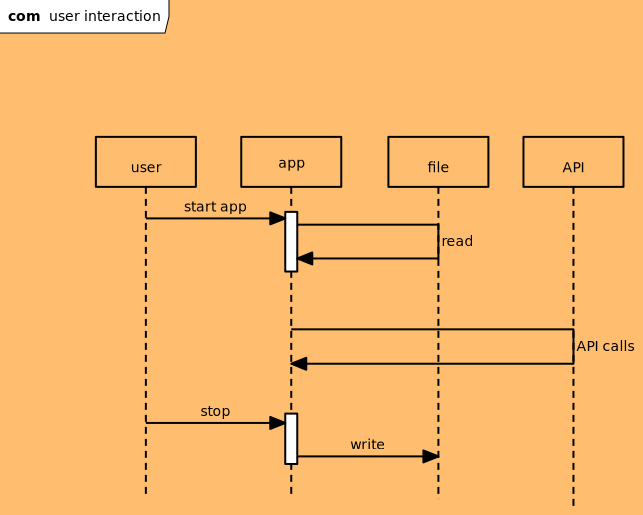
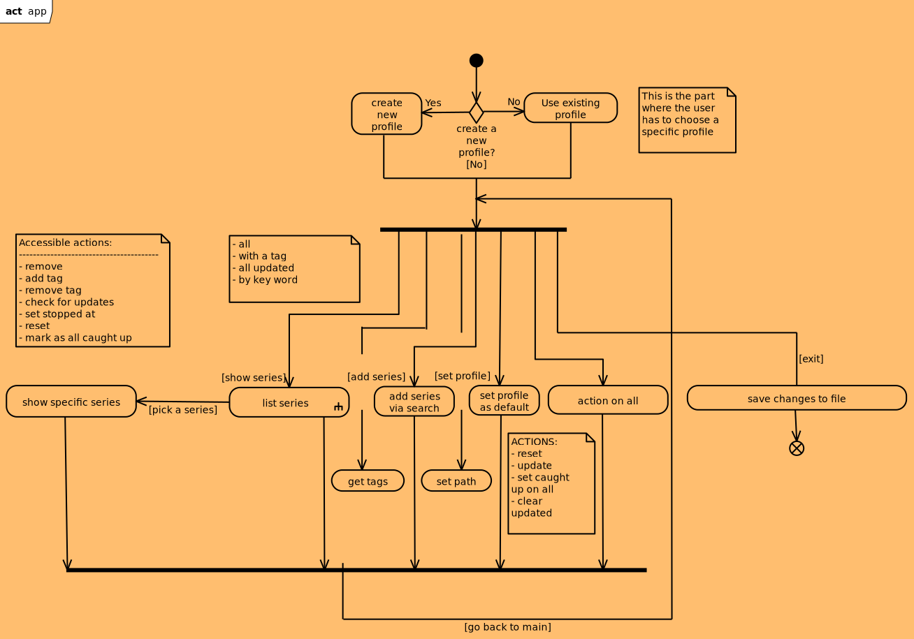
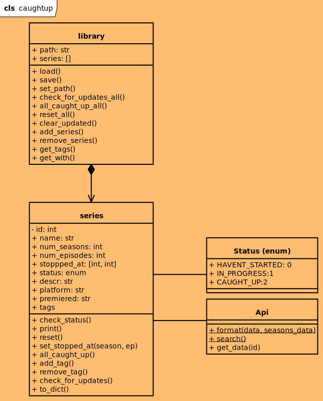

# Caught up

|label|value|
|---|---|
|goal| Make a CLI tool for looking up series status and keeping track using external APIs|
|language|Python|
|date| 12.08.2026|

## Scenarious

***Target audience:*** regular people, non developers who want to go away from big platforms

### Tutorial/startup
There should be some way for user to learn about app functions and what it can do and how.

### Make a list
A user wants to make a list of series they watched throughout their life and organize it by tags or categories. They add each series by looking it up and adding the point where they stopped if started watching.

### Is anything new
A user has a series list and wants to see if anything new has come out from them. For instance, were there new episodes since the last check.

### Tags and organization
A user wants to create tags and mark the series somehow to organize them better in the system.

## Goals/requirement

The interface should priorotize simplicity for the user. Minimum libraries should be installed or the install steps should be clearly provided. 

It should be something a user of any platform(Windows, macOS, Linux) can download and get running in minutes. (5 minutes for download and setup)

## Structure

There should be several components:
1. CLI
2. CLASSES in Python and their inner logic
3. Data store implemented either as simple RDBMS or a file
4. API as a base for series data

## CLI
The general user interaction pattern can be seen in the diagram below. Essentially, first a file is either read or an empty profile is created. Then all interactions and data is stored in RAM during the session and is only written to file at very end of the session on **exit**. This is done to avoid reading and writing too many times to memory and avoid slow down as well as hardware degradation.

The API calls are also done during the session. All this means that if some errors happen during the session the data, that is not saved, is lost.

The user journeuy the user takes can be seen below. It has several key stages:
1. login/loading of the profile happens first
2. main user loop where all the actions happen
3. exit action that saves the data and closes the app

## Classes

There are 3 key classes in this project all present in the core folder in corresponding files:
- **Api**: api requests hidden by methods
- **Series**: a single series a user watched
- **Library**: storage of many series

1 more class is the **STATUS** enum class that is used by the **Series** class.

The class methods more directly can be seen in this diagram.

## Storage

The storage takes form of a json file that is placed into the storage folder. It is quite simple and allows to copy, edit the profile and whatever else a user can do with a simple file.

Also, it means that no database needs to be deployed.

## API

## Scenarious with details

### Tutorial/startup

At first it should check the config file for the library file path to use. If nothing is specified the user should be prompted to enter it or to create a new file.

Then main screen should be shown with library methods represented as buttons to use alongside of course the ability to see the full list or tags.